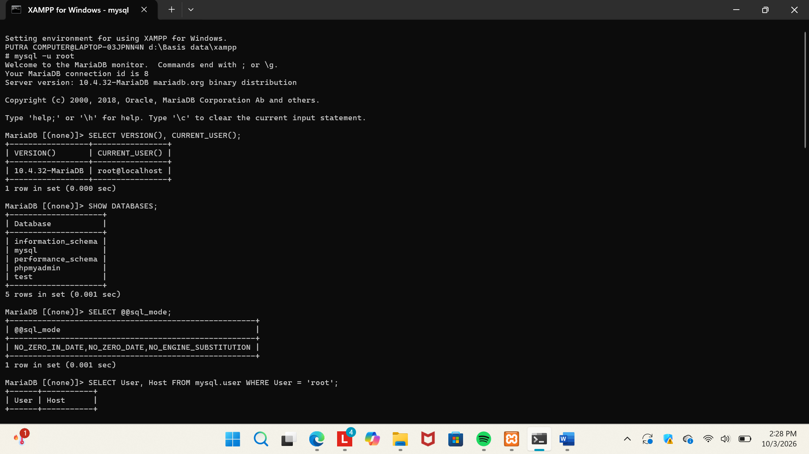
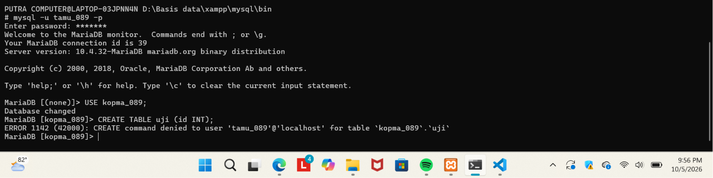
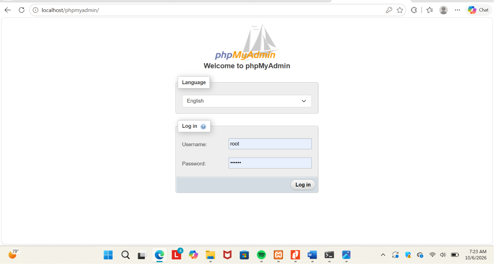
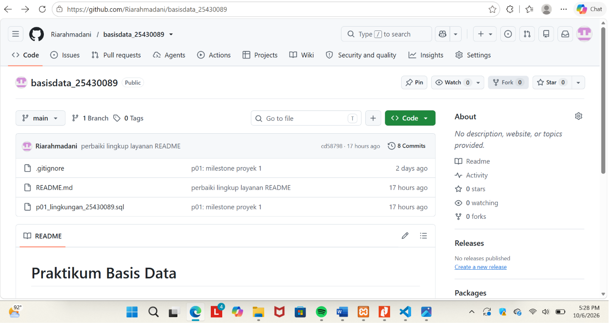
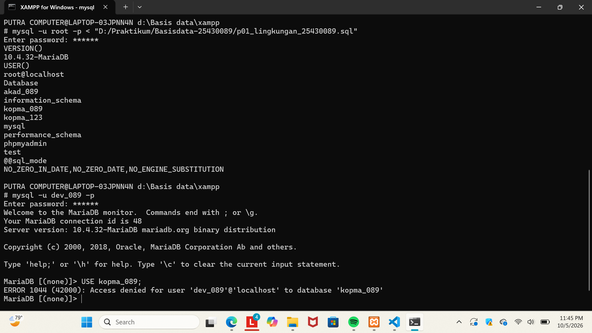

# 📘 LAPORAN PRAKTIKUM BASIS DATA - PERTEMUAN 1

**Nama:** Ria Rahmadani  
**NIM:** 25430089  
**Kelas:** D  
**Tanggal:** 6 Oktober 2026  
**Dosen Pembimbing:** Dedi Irawan, S.Kom., M.T.I.

---

## 1. Tujuan Praktikum

Praktikum ini bertujuan untuk mengenal lingkungan kerja MariaDB melalui XAMPP, mengatur akun dan hak akses database, menggunakan phpMyAdmin, serta menyiapkan repository GitHub untuk menyimpan hasil praktikum dan proyek.

---

## 2. Ringkasan Dasar Teori

MariaDB merupakan sistem manajemen basis data yang digunakan untuk menyimpan dan mengelola data menggunakan SQL. Pada praktikum ini MariaDB dijalankan melalui XAMPP dan diakses melalui Command Prompt/Git Bash maupun phpMyAdmin.

Setiap akun MariaDB dapat memiliki hak akses yang berbeda. Hak akses tersebut dapat diberikan menggunakan `GRANT`, sehingga suatu akun hanya dapat mengakses database yang memang diberikan kepadanya.

Selain database, praktikum juga menggunakan Git dan GitHub untuk menyimpan file SQL dan dokumentasi proyek. Dengan begitu, hasil pekerjaan memiliki riwayat perubahan dan dapat digunakan kembali jika terjadi masalah pada database lokal.

---

## 3. Hasil Langkah Percobaan

### 3.1 Mengecek Versi dan Akun MariaDB

Perintah yang digunakan:

```sql
SELECT VERSION(), CURRENT_USER();
```
Hasil menunjukkan bahwa MariaDB yang digunakan adalah versi 10.4.32-MariaDB dan akses dilakukan menggunakan akun root.

Bukti Screenshot:


### 3.2 Mengecek Database dan SQL Mode

Perintah:

```sql
SHOW DATABASES;
```

digunakan untuk melihat database yang tersedia.

Kemudian dilakukan pengecekan mode SQL dengan:

```sql
SELECT @@sql_mode;
```

Hasil menunjukkan bahwa MariaDB menggunakan mode yang memuat STRICT_TRANS_TABLES.

Bukti Screenshot:


### 3.3 Membuat Database dan Akun Kerja

Database praktik dibuat dengan nama:

-   `kopma_089`

Database tersebut menggunakan karakter set utf8mb4 dan collation utf8mb4_unicode_ci.

Kemudian dibuat akun kerja:

-   `Ria_089`

Akun tersebut diberikan hak akses pada database kopma_089.

### 3.4 Membuat Akun Tamu

Pada latihan dibuat akun:

-   `tamu_089`

Akun tersebut hanya diberikan hak SELECT pada database kopma_089.

Saat akun tersebut mencoba menjalankan:

```sql
CREATE TABLE uji (id INT);
```

muncul error:

```sql
ERROR 1142 (42000): CREATE command denied
```

Hal ini menunjukkan bahwa akun tamu_089 tidak memiliki izin untuk membuat tabel.

Bukti Screenshot:


### 3.5 Pengaturan phpMyAdmin

Pengaturan autentikasi phpMyAdmin diubah menjadi mode cookie, sehingga pengguna harus memasukkan username dan password ketika login.

Bukti Screenshot:


### 3.6 Menyiapkan Repository GitHub**

Repository proyek dibuat dengan nama:

- `basisdata_25430089`

File utama yang digunakan antara lain:

```sql
README.md
p01_lingkungan_25430089.sql
.gitignore
```

Repository kemudian dihubungkan dengan GitHub dan perubahan berhasil di-push.

Bukti Screenshot:


---

## 4. Jawaban Titik Analisis
Titik Analisis 1

Mode SQL ketat seperti STRICT_TRANS_TABLES penting karena MariaDB akan lebih tegas dalam menangani data yang tidak sesuai aturan. Data yang tidak valid tidak langsung diterima atau diubah secara diam-diam, sehingga kesalahan lebih mudah diketahui.

Titik Analisis 2

Jika masuk menggunakan:

```sql
mysql -u root
```

tanpa opsi -p, MariaDB tidak menerima password dari pengguna. Jika akun root sudah diberi password, akan muncul error 1045.

Perbedaan using password: NO dan using password: YES terletak pada apakah password dikirim oleh client.

using password: NO → password tidak dikirim.
using password: YES → password dikirim tetapi tidak diterima oleh server.
Titik Analisis 3

information_schema tetap dapat terlihat karena database tersebut merupakan database sistem yang menyediakan informasi mengenai struktur database dan objek MariaDB.

Sementara itu, mysql merupakan database sistem yang memiliki pembatasan akses. Karena akun kerja tidak diberikan hak untuk membuka database tersebut, maka muncul ERROR 1044.

Perbedaannya dengan ERROR 1045 adalah:


Mode cookie lebih aman karena password tidak disimpan langsung di file konfigurasi phpMyAdmin. Pengguna harus memasukkan username dan password ketika login.

Dengan begitu, password tidak tertulis secara langsung di konfigurasi seperti pada mode config.

---

## 5. Hasil Latihan dan Modifikasi**

Pada latihan dibuat akun tamu_089 yang hanya memiliki hak SELECT pada database kopma_089.

Pembatasan tersebut diuji dengan mencoba membuat tabel:

```sql
CREATE TABLE uji (id INT);
```

Hasilnya ditolak dengan ERROR 1142, sehingga hak akses akun sudah sesuai.

Selain itu, file SQL dibuat agar dapat dijalankan kembali dengan menggunakan:

```sql
CREATE DATABASE IF NOT EXISTS ...
CREATE USER IF NOT EXISTS ...
```

Dengan cara tersebut, script tidak langsung gagal hanya karena database atau akun sudah pernah dibuat sebelumnya.

---

## 6. Tugas Mandiri: Milestone Proyek 1
### 6.1 Database Proyek

Tema proyek yang dipilih adalah Akademik.

Database proyek yang dibuat:

- `akad_089`

Database dibuat menggunakan:

Character Set : utf8mb4
Collation     : utf8mb4_unicode_ci
### 6.2 Akun Developer

Dibuat akun:

-   `dev_089`

Akun tersebut diberikan hak penuh hanya pada database:

-   `akad_089`

Pengujian dilakukan dengan:

```sql
USE akad_089;
SHOW TABLES;
```

Hasilnya berhasil masuk ke database akad_089.

Saat mencoba:

```sql
USE kopma_089;
```

muncul:

ERROR 1044 (42000): Access denied for user 'dev_089'@'localhost' to database 'kopma_089'

Artinya akun dev_089 sudah berhasil dibatasi hanya untuk database proyek.

Bukti Screenshot:


dev_089 berhasil USE akad_089
dev_089 ditolak saat USE kopma_089

Database akad_089 belum memiliki tabel karena pembuatan tabel belum menjadi bagian dari Milestone Proyek 1.

### 6.3 Identitas Proyek

Tema: Akademik

Nama Organisasi: Academic Center RR

Lingkup Layanan:

Academic Center RR merupakan organisasi fiktif yang bergerak dalam pengelolaan layanan akademik mahasiswa. Sistem ini digunakan untuk mengelola data mahasiswa, mata kuliah, jadwal perkuliahan, KRS, serta nilai akademik.

### 6.4 File .gitignore**

File .gitignore dibuat untuk mencegah file yang berisi kredensial ikut masuk ke repository.

Isi file:

*.env
kredensial*.txt

Password asli tidak dimasukkan ke dalam repository.

### 6.5 Commit dan Push

Milestone proyek berhasil di-commit dengan pesan:

p01: milestone proyek 1

Commit tersebut kemudian berhasil di-push ke GitHub.

Perubahan pada README juga telah diperbarui dan di-push ke repository.

---

## 7. Pembahasan dan Kendala

Selama praktikum, salah satu kendala yang ditemui adalah MySQL shutdown unexpectedly setelah komputer mati secara mendadak.

Dari kejadian tersebut, saya memahami bahwa pesan pada Control Panel hanya menunjukkan masalah secara umum. Untuk mengetahui penyebabnya, perlu melihat mysql_error.log dan membaca bagian terakhir yang memiliki [ERROR].

Kejadian ini juga membuat saya lebih paham pentingnya menyimpan script SQL di GitHub. Jadi, jika database lokal mengalami masalah, database masih dapat dibuat kembali dari script yang sudah tersimpan.

---

## 8. Kesimpulan

Praktikum Pertemuan 1 membuat saya memahami dasar penggunaan MariaDB melalui XAMPP, mulai dari login, pembuatan database dan akun, sampai pengaturan hak akses. Saya juga belajar bahwa setiap akun dapat memiliki hak yang berbeda sesuai kebutuhannya.

Selain itu, saya berhasil membuat database dan akun untuk proyek Akademik serta menyiapkan repository GitHub sebagai tempat penyimpanan hasil praktikum dan proyek.

---

## 9. Pernyataan Penggunaan AI

AI digunakan sebagai bantuan dalam memahami beberapa konsep dan membantu merapikan penyusunan laporan. Perintah SQL dan hasil praktikum tetap dikerjakan dan diuji pada lingkungan MariaDB/XAMPP yang digunakan dalam praktikum.

---

## 10. Bukti Git
Repository: basisdata-25430089
Hash Commit: 3f9c2ab
Pesan Commit: P01: inisialisasi repositori dan skrip lingkungan

Link Repository:
https://github.com/Riarahmadani/basisdata-2301010123

| No | Komponen Checklist | Status / Keterangan |
| :---: | :--- | :---: |
| 1 | Identitas mahasiswa | ✅ Selesai |
| 2 | Tujuan praktikum | ✅ Selesai |
| 3 | Ringkasan dasar teori | ✅ Selesai |
| 4 | Hasil langkah percobaan | ✅ Selesai |
| 5 | Jawaban Titik Analisis 1–4 | ✅ Selesai |
| 6 | Hasil latihan dan modifikasi | ✅ Selesai |
| 7 | Milestone Proyek 1 | ✅ Selesai |
| 8 | Database `akad_089` | ✅ Selesai |
| 9 | Akun `dev_089` | ✅ Selesai |
| 10 | Pembuktian akses `dev_089` ke `kopma_089` ditolak | ✅ Selesai |
| 11 | README dengan Identitas Proyek | ✅ Selesai |
| 12 | `.gitignore` | ✅ Selesai |
| 13 | Commit dan push ke GitHub | ✅ Selesai |
| 14 | Screenshot `SELECT VERSION(), CURRENT_USER();` | ✅ Selesai |
| 15 | Screenshot `SELECT @@sql_mode;` | ✅ Selesai |
| 16 | Screenshot `ERROR 1142` | ✅ Selesai |
| 17 | Screenshot `ERROR 1044` | ✅ Selesai |
| 18 | Screenshot login phpMyAdmin | ✅ Selesai |
| 19 | Screenshot Git push | ✅ Selesai |