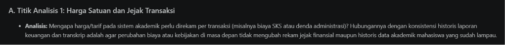
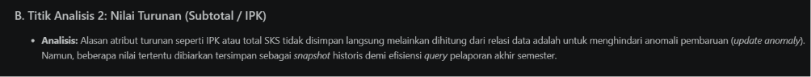
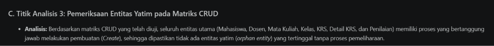
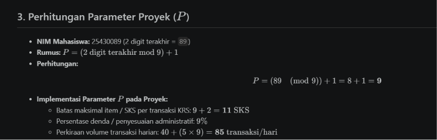
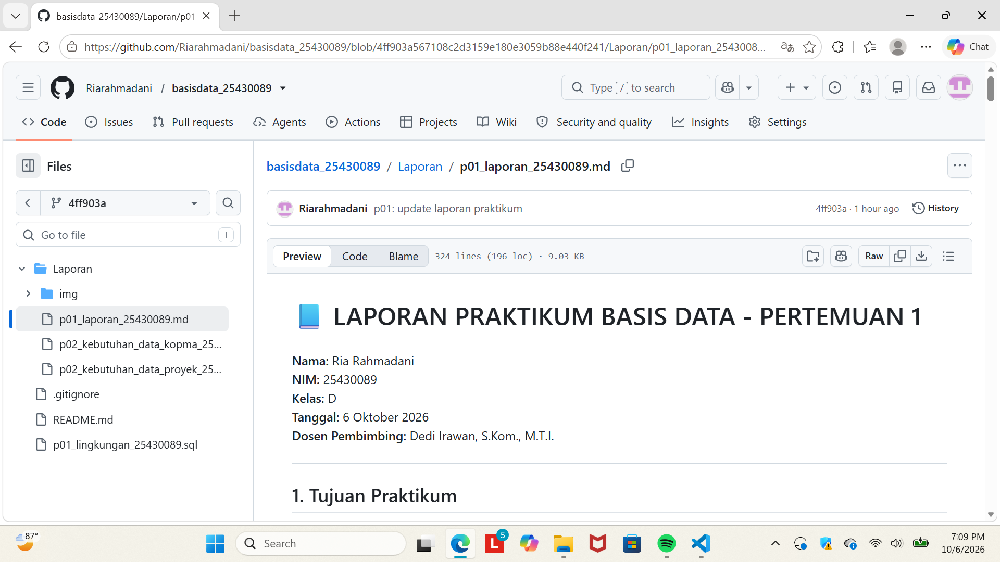

# Laporan Praktikum Basis Data - Pertemuan / Modul 2
**Analisis Kebutuhan Pengelolaan Data**

---

## Identitas Mahasiswa
* **Nama:** Ria Rahmadani
* **NIM:** 25430089
* **Kelas:** D
* **Tema Proyek:** Akademik
* **Nama Organisasi:** Academic Center RR
* **Dosen Pembimbing:** Dedi Irawan, S.Kom., M.T.I.

---

## 1. Ringkasan Pelaksanaan Praktikum
Pada praktikum Modul 2 ini, kegiatan difokuskan pada perumusan analisis kebutuhan data sebelum melakukan perancangan basis data relasional. Tahapan mencakup identifikasi proses bisnis, pembedahan dokumen sumber fiktif (lembar KRS), penurunan entitas kandidat, perumusan aturan bisnis, penyusunan matriks CRUD, pembuatan kamus data awal dengan penanggung jawab (*data steward*), serta penentuan kebutuhan non-fungsional berdasarkan parameter personal ($P = 9$).

---

## 2. Bukti Tangkapan Layar & Titik Analisis

### A. Titik Analisis 1: Harga Satuan dan Jejak Transaksi
* **Analisis:** Mengapa harga/tarif pada sistem akademik perlu direkam per transaksi (misalnya biaya SKS atau denda administrasi)? Hubungannya dengan konsistensi historis laporan keuangan dan transkrip adalah agar perubahan biaya atau kebijakan di masa depan tidak mengubah rekam jejak finansial maupun historis data akademik mahasiswa yang sudah lampau.

### B. Titik Analisis 2: Nilai Turunan (Subtotal / IPK)
* **Analisis:** Alasan atribut turunan seperti IPK atau total SKS tidak disimpan langsung melainkan dihitung dari relasi data adalah untuk menghindari anomali pembaruan (*update anomaly*). Namun, beberapa nilai tertentu dibiarkan tersimpan sebagai *snapshot* historis demi efisiensi *query* pelaporan akhir semester.

### C. Titik Analisis 3: Pemeriksaan Entitas Yatim pada Matriks CRUD
* **Analisis:** Berdasarkan matriks CRUD yang telah diuji, seluruh entitas utama (Mahasiswa, Dosen, Mata Kuliah, Kelas, KRS, Detail KRS, dan Penilaian) memiliki proses yang bertanggung jawab melakukan pembuatan (*Create*), sehingga dipastikan tidak ada entitas yatim (*orphan entity*) yang tertinggal tanpa proses pemeliharaan.

---

## 3. Perhitungan Parameter Proyek ($P$)
* **NIM Mahasiswa:** 25430089 (2 digit terakhir = `89`)
* **Rumus:** $P = (2 \text{ digit terakhir mod } 9) + 1$
* **Perhitungan:** 
  $$P = (89 \pmod 9) + 1 = 8 + 1 = \mathbf{9}$$
* **Implementasi Parameter $P$ pada Proyek:**
  * Batas maksimal item / SKS per transaksi KRS: $9 + 2 = \mathbf{11 \text{ SKS}}$
  * Persentase denda / penyesuaian administratif: **$9\%$**
  * Perkiraan volume transaksi harian: $40 + (5 \times 9) = \mathbf{85 \text{ transaksi/hari}}$

---

## 4. Perbaikan Pernyataan Kebutuhan Kabur

1. **Pernyataan 1:**
   * *Sebelum:* "Data mahasiswa harus aman."
   * *Sesudah (Dapat Diuji):* "Password akun mahasiswa wajib dienkripsi menggunakan algoritma *hashing* standar industri (*bcrypt*), dan hak akses peninjauan data pribadi dibatasi eksklusif hanya untuk peran Bagian Akademik melalui sistem login terautentikasi."
2. **Pernyataan 2:**
   * *Sebelum:* "Sistem harus cepat mencari mata kuliah."
   * *Sesudah (Dapat Diuji):* "Pencarian data mata kuliah berdasarkan `kode_mk` atau `nama_mk` pada katalog KRS wajib menghasilkan respons keluaran data (*response time*) dalam waktu kurang dari 0,5 detik untuk total 500 data mata kuliah aktif."
3. **Pernyataan 3:**
   * *Sebelum:* "Laporan kapasitas kelas harus akurat."
   * *Sesudah (Dapat Diuji):* "Selisih antara jumlah kuota kursi terpakai pada tabel `Kelas Perkuliahan` dan jumlah riil mahasiswa yang memprogramkan KRS pada akhir periode pengisian harus bernilai 0 (nol)."

---

## 5. Checklist Kelengkapan Laporan

| Status | Komponen Laporan / Berkas | Keterangan |
| :---: | :--- | :--- |
| ✅ | Berkas `p02_kebutuhan_data_25430089.md` | Lengkap (Latar belakang hingga isu kualitas) |
| ✅ | Berkas `p02_laporan_25430089.md` | Berhasil disusun sesuai format baku |
| ✅ | Bukti Tangkapan Layar & Titik Analisis 1–3 | Selesai dianalisis |
| ✅ | Perhitungan Parameter Proyek ($P = 9$) | Terdokumentasi dengan benar |
| ✅ | Perbaikan 3 Pernyataan Kabur | Terverifikasi dapat diuji |
| ✅ | Tabel PB, AB, KI, Matriks CRUD, Kamus Data | Lengkap dan konsisten |

---

## 6. Bukti Tangkapan Layar Repositori GitHub

* **Tautan Repositori GitHub:** [https://github.com/Riarahmadani/basisdata_25430089](https://github.com/Riarahmadani/basisdata_25430089)

---
*Laporan praktikum ini disusun secara mandiri sebagai pemenuhan Milestone Modul 2 Praktikum Basis Data.*